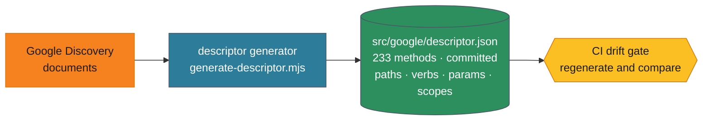
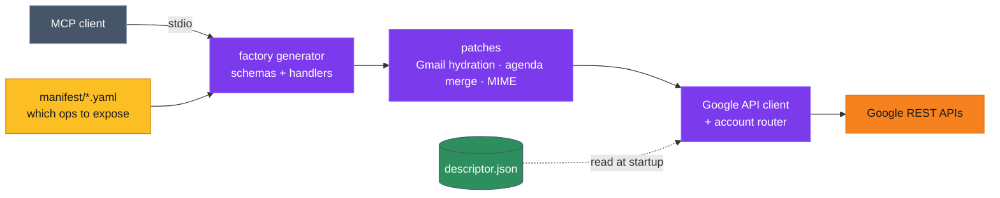

# Google Workspace MCP Server

[](https://www.npmjs.com/package/@aaronsb/google-workspace-mcp)
[](https://github.com/aaronsb/google-workspace-mcp/releases)
[](https://nodejs.org)
[](LICENSE)

Give AI agents real access to Google Workspace — Gmail, Calendar, Drive, Docs, Sheets, Tasks, and Meet — through a single MCP server that handles multi-account credential routing, response shaping for AI consumption, and contextual next-step guidance.

The server talks to Google's REST APIs directly, through a client it builds **from Google's own machine-readable API specifications**. Google publishes a [Discovery document](https://developers.google.com/discovery) for every API; a build step reads them and generates the descriptor this server dispatches against. Google's API surface *is* the source of truth — not a hand-maintained wrapper, and not a third-party CLI.

## Why This MCP Server

**For users:** One install gives your agent authenticated access to your Google accounts. Search email, check your calendar, manage Drive files, chain multi-step workflows — through natural conversation.

**For teams:** Multi-account support lets one agent work across personal and work accounts at once, with per-account credential isolation and XDG-compliant storage.

**For developers:** Adding an operation is a YAML edit, not a code change. The manifest curates which of Google's methods to expose; the generated descriptor already knows every method's path, HTTP verb, parameters, and scopes. Nothing is transcribed by hand, so nothing drifts from Google.

## What's Available

**11 tools — 7 Google services (80 operations), plus accounts, batching, content authoring, and a file sandbox.**

| Tool | What It Does |
|------|--------------|
| `manage_email` | Gmail — search, read (plain or sanitized HTML), send, reply / reply-all, forward, triage, trash, labels, threads, attachments |
| `manage_calendar` | Calendar — list, agenda, get, create, quickAdd (natural language), update, delete, calendars, freebusy |
| `manage_drive` | Drive — search, get, upload, download, copy, rename / move, delete, export, permissions, comments, view images |
| `manage_sheets` | Sheets — read / write ranges (row-numbered output), append, clear, manage tabs, copy / duplicate / rename |
| `manage_docs` | Docs — get, create, append, insert text, find-and-replace |
| `manage_tasks` | Tasks — list / create / update / complete tasks and task lists |
| `manage_meet` | Meet — browse past conferences, participants, transcripts, recordings, smart notes |
| `manage_accounts` | Multi-account lifecycle — add accounts, manage credentials and scopes |
| `manage_scratchpad` | Compose / edit multi-line content (line- or JSON-path-addressed), attach files, send to any target; JSON mode live-syncs to Docs / Sheets |
| `manage_workspace` | File operations in the workspace sandbox (exchange point for attachments, downloads, exports) |
| `queue_operations` | Chain operations sequentially with `$N.field` result references |

Every response carries **next-steps** guidance, so the agent always knows what it can do next.

Those 80 operations reach 60 of the 233 methods Google publishes across these seven APIs.

**Missing something you need?** The rest of the surface is mapped, not guessed. **[Browse every method Google publishes](docs/api-surface.md)** — what it does, whether we expose it, and a one-click link to request it. The descriptions are Google's own, and the page is generated from the same specification the client is built from, so it can't drift.

The subset is curated on purpose: an agent has to *choose* among these, and every method it must weigh is one it can pick wrongly. But that judgement was made without you — if it's wrong for your case, **[say so](docs/coverage.md)**. A good request names the task, not the method.

## How It Works

Two phases. Google's API specification is acquired at **build time** and frozen into a committed artifact; at **runtime** the server only reads it.

### Build time — acquire the specification



### Runtime — dispatch against it



**The descriptor** is generated from Google's Discovery documents and committed. A CI drift gate re-generates it and fails if the result differs, so the spec we dispatch against cannot silently fall behind Google.

**The client** (`src/google/client.ts`) is deliberately opinion-free: it builds the request Google's spec describes and returns exactly what Google returned. It does not reshape responses. All interpretation lives in patches and formatters, aimed at the MCP contract — which is what keeps "what Google said" and "what we chose to show" separable.

**The factory** reads the YAML manifest and generates MCP tool schemas and handlers at startup. **Patches** add behavior where an agent needs more than a raw API response — hydrating Gmail search results with senders and subjects, merging an agenda across calendars, building MIME for outbound mail. Operations without a patch get sensible defaults.

Because method names are generated into a TypeScript union, calling a method Google doesn't publish is a **compile error**, not a 404 at runtime.

## Install

### MCPB Bundle (Claude Desktop and other MCP clients)

Download `google-workspace-mcp.mcpb` from the [latest release](https://github.com/aaronsb/google-workspace-mcp/releases).

One bundle covers every platform — macOS (Intel and Apple Silicon), Linux (x64 and ARM64), and Windows. There is nothing to choose: the server is pure JavaScript on Node, so there is no platform-specific payload to pick between. It needs Node 22.12 or newer.

In Claude Desktop, drag the `.mcpb` file into the app — it will prompt for your Google OAuth credentials. Other MCP clients that support `.mcpb` extensions install it the same way. The bundle includes the server and all of its dependencies.

### Claude Code / npm

```bash
npm install @aaronsb/google-workspace-mcp
```

Or run directly:

```bash
npx @aaronsb/google-workspace-mcp
```

### Prerequisites

1. **Node.js** 22.12 or newer — Node 18 and 20 are both end-of-life.
2. **Google Cloud OAuth credentials** — create at [console.cloud.google.com/apis/credentials](https://console.cloud.google.com/apis/credentials):
   - Create an OAuth 2.0 Client ID (Desktop application)
   - Enable the APIs you want (Gmail, Calendar, Drive, Sheets, …)
3. Set environment variables:
   ```bash
   export GOOGLE_CLIENT_ID="your-client-id"
   export GOOGLE_CLIENT_SECRET="your-client-secret"
   ```

## MCP Client Configuration

### Claude Desktop

Add to `claude_desktop_config.json`:

```json
{
  "mcpServers": {
    "google-workspace": {
      "command": "npx",
      "args": ["@aaronsb/google-workspace-mcp"],
      "env": {
        "GOOGLE_CLIENT_ID": "your-client-id",
        "GOOGLE_CLIENT_SECRET": "your-client-secret"
      }
    }
  }
}
```

### Claude Code

Add to `.mcp.json`:

```json
{
  "mcpServers": {
    "google-workspace": {
      "command": "npx",
      "args": ["@aaronsb/google-workspace-mcp"],
      "env": {
        "GOOGLE_CLIENT_ID": "your-client-id",
        "GOOGLE_CLIENT_SECRET": "your-client-secret"
      }
    }
  }
}
```

## Usage

Add an account (opens a browser for OAuth):

```
manage_accounts { "operation": "authenticate" }
```

Then use any tool with your account email:

```
manage_email    { "operation": "triage", "email": "you@gmail.com" }
manage_calendar { "operation": "agenda", "email": "you@gmail.com" }
manage_drive    { "operation": "search", "email": "you@gmail.com", "query": "quarterly report" }
```

### Multi-Step Workflows

Chain operations with result references — the output of one step feeds the next:

```json
{
  "operations": [
    { "tool": "manage_email", "args": { "operation": "search", "email": "you@gmail.com", "query": "from:boss subject:review" }},
    { "tool": "manage_email", "args": { "operation": "read", "email": "you@gmail.com", "messageId": "$0.messageId" }}
  ]
}
```

## Expanding Coverage

The coverage mapper diffs what the manifest exposes against what Google actually publishes, so the frontier is always measured rather than estimated:

```bash
npm run generate-descriptor   # re-read Google's Discovery documents
make coverage                 # what we expose vs. what Google offers
make manifest-lint            # validate the curated manifest
make check                    # type-check, lint, test, build, smoke
```

To expose a new operation, add it to the relevant `src/factory/manifest/*.yaml`. The descriptor already knows its path, verb, parameters, and scopes, and the factory generates the tool schema and handler. New operations get default formatting automatically — add a patch only when an agent needs a shaped response rather than a raw one.

## Data Storage

Follows the XDG Base Directory Specification:

| Data | Location |
|------|----------|
| Account registry | `~/.config/google-workspace-mcp/accounts.json` |
| Credentials | `~/.local/share/google-workspace-mcp/credentials/` |
| Workspace (file exchange) | `~/.local/share/google-workspace-mcp/workspace/` |

Credentials are per-account files holding standard OAuth tokens. No secrets are stored in the project directory.

## Design

The server generates its API client from Google's own Discovery documents and calls Google directly. Nothing sits between the server and the API it targets: there is no subprocess, no second response shape, and no unversioned wrapper to keep in step. The descriptor is regenerated and diffed against Google on every build, so a method that does not exist is a compile error rather than a runtime surprise.

On top of that sits the manifest-driven tool factory: adding an operation is a YAML edit, not a code change. The coverage mapper reads Google's real published surface, so "what we expose vs what exists" is a measured number.

The reasoning behind this design, including what was verified and what it cost, is in **[ADR-103](docs/architecture/core/ADR-103-generate-a-google-api-descriptor-retire-the-gws-facade.md)**.

## License

[Apache License 2.0](LICENSE).

Through v3.0.0 this project was MIT-licensed. Those contributions keep their original
notice (`LICENSE-MIT`), and the contributors are credited in [`NOTICE`](NOTICE). Apache 2.0
adds an explicit patent grant and a state-your-changes requirement; it does not take back
anything MIT permitted.
