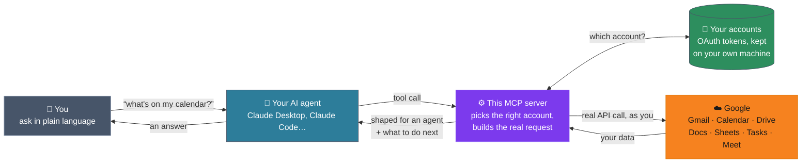
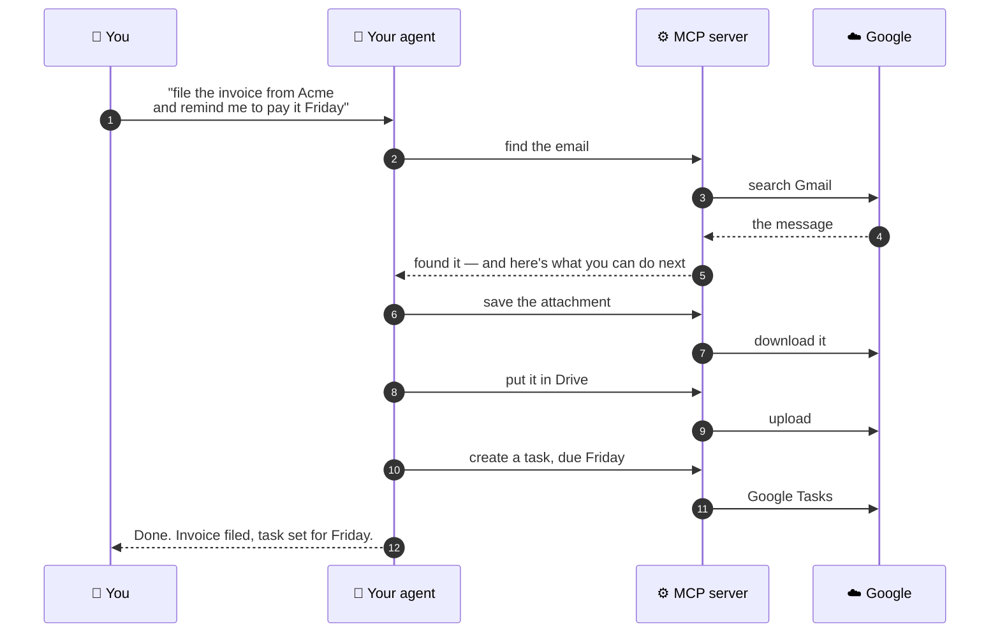

# Google Workspace MCP Server

[](https://www.npmjs.com/package/@aaronsb/google-workspace-mcp)
[](https://github.com/aaronsb/google-workspace-mcp/releases)
[](https://nodejs.org)
[](LICENSE)

**Give your AI agent real access to Google Workspace** — Gmail, Calendar, Drive, Docs, Sheets, Tasks and Meet — from one MCP server, across as many accounts as you have.

Search your mail, check your calendar, write a doc, file a task — in conversation, as yourself.

## Install

First, you need **Google OAuth credentials** — the one prerequisite common to every path:

1. Go to [console.cloud.google.com/apis/credentials](https://console.cloud.google.com/apis/credentials)
2. Create an **OAuth 2.0 Client ID**, application type **Desktop app**
3. Enable the APIs you want (Gmail, Calendar, Drive, Sheets, Docs, Tasks, Meet)
4. Keep the **Client ID** and **Client Secret** handy — you'll paste them in below

Then pick the path that matches how you work. All three run the same server.

Node 22.12 or newer. (Node 18 and 20 are both end-of-life.)

---

### 📦 → 🤖 Claude Desktop — one-click `.mcpb` install (recommended)

Download **`google-workspace-mcp.mcpb`** from the [latest release](https://github.com/aaronsb/google-workspace-mcp/releases/latest), then **drag it onto the Claude Desktop window**, or double-click it.

Claude Desktop opens an install dialog with three fields:

| Field | |
|---|---|
| **Google OAuth Client ID** | required — from the step above |
| **Google OAuth Client Secret** | required — from the step above |
| **Workspace Directory** | optional — where attachments, downloads and exports land. Defaults to `~/.local/share/google-workspace-mcp/workspace/`. Give it a dedicated folder — not your home, Documents, Desktop, or a Google Drive folder. |

Paste, hit Save, done. No JSON to edit, no Node to install, no paths to get right — the bundle carries the server and every dependency.

**One bundle covers every platform** — macOS (Intel and Apple Silicon), Linux (x64 and ARM64), and Windows. There is nothing to choose: the server is pure JavaScript, so there is no platform-specific payload to pick between.

> *Cross-platform note:* `.mcpb` files install via Claude Desktop's bundled handler. If double-clicking doesn't trigger Claude on your system, drag the file onto the Claude Desktop window instead, or right-click → "Open with…" and pick Claude Desktop (then "always open with" if your OS offers). Behavior varies: macOS usually auto-associates, Windows may need a one-time association, Linux varies by desktop environment.

---

### Claude Code — one command

```bash
claude mcp add google-workspace \
  -e GOOGLE_CLIENT_ID=your-client-id \
  -e GOOGLE_CLIENT_SECRET=your-client-secret \
  -- npx -y @aaronsb/google-workspace-mcp
```

That's it — no file to edit. Verify with `/mcp`.

---

### Other MCP clients

Add an entry to the client's MCP config file (for Claude Desktop by hand, that's `claude_desktop_config.json`; for Claude Code, `.mcp.json`):

```json
{
  "mcpServers": {
    "google-workspace": {
      "command": "npx",
      "args": ["-y", "@aaronsb/google-workspace-mcp"],
      "env": {
        "GOOGLE_CLIENT_ID": "your-client-id",
        "GOOGLE_CLIENT_SECRET": "your-client-secret"
      }
    }
  }
}
```

Or install it globally and point at the binary directly:

```bash
npm install -g @aaronsb/google-workspace-mcp
```

## How it fits together



**Your credentials never leave your machine.** The server holds an OAuth token per account, on your own disk, and calls Google *as you* — there is no middleman service, no account of ours, nothing to sign up for. Add as many accounts as you like (personal and work, side by side); the server routes each request to the right one.

## What it can do

**11 tools across 7 Google services**, plus multi-account handling, batching, content authoring, and a file sandbox.

| Tool | What It Does |
|------|--------------|
| `manage_email` | Gmail — search, read (plain or sanitized HTML), send, reply / reply-all, forward, triage, trash, labels, threads, attachments |
| `manage_calendar` | Calendar — list, agenda, get, create, quickAdd (natural language), update, delete, calendars, freebusy |
| `manage_drive` | Drive — search, get, upload, download, copy, rename / move, delete, export, permissions, comments, view images |
| `manage_sheets` | Sheets — read / write ranges (row-numbered output), append, clear, manage tabs, copy / duplicate / rename |
| `manage_docs` | Docs — get, create, append, insert text, find-and-replace |
| `manage_tasks` | Tasks — list / create / update / complete tasks and task lists |
| `manage_meet` | Meet — browse past conferences, participants, transcripts, recordings, smart notes |
| `manage_accounts` | Multi-account lifecycle — add accounts, manage credentials and scopes |
| `manage_scratchpad` | Compose / edit multi-line content (line- or JSON-path-addressed), attach files, send to any target; JSON mode live-syncs to Docs / Sheets |
| `manage_workspace` | File operations in the workspace sandbox (exchange point for attachments, downloads, exports) |
| `queue_operations` | Chain operations sequentially with `$N.field` result references |

Every response carries **next-steps** guidance, so the agent always knows what it can do next.

## One ask, many steps

The useful part isn't any single operation — it's that your agent can **string them together**.

You ask for one thing. The agent works out that it needs four API calls, in order, each one feeding the next:



Two things make this work. Every response tells the agent **what it can do next**, so it isn't guessing at the next step. And `queue_operations` lets it run a whole chain in **one call**, feeding each result into the next — so "find the invoice, file it, remind me" is a single round trip rather than four.

## Ask for what's missing

This server exposes **80 operations**, reaching 60 of the **233 methods** Google publishes across those seven APIs. It is a curated subset on purpose: an agent has to *choose* among these, and every method it must weigh is one it can pick wrongly. A tool with 233 operations isn't more capable than one with 80 — it's harder to use correctly.

But that judgement was made without you.

**→ [Browse every method Google publishes](docs/api-surface.md)**

Every method is listed — what it does, whether we expose it, and a **Request** link that opens a pre-filled issue. The descriptions are Google's own, quoted verbatim, and the page is generated from the same specification the client is built from, so it can't drift from reality.

That page also lists **four whole APIs this server doesn't touch yet** — Chat, Contacts, Slides and Forms — for the same reason: *not targeted* is a decision, not a fact of nature.

A good request **names the task, not the method**:

> *"I want the agent to file incoming invoices into a folder automatically."*

That can be evaluated. It might turn out an existing operation already does it, or that the right answer is a different method than the one you found. *"Expose `users.settings.filters.create`"* is a conclusion, not a case — lead with the problem and let the method follow.

## Why Apache 2.0, and not open core

**Everything is here.** There is no paid tier, no "enterprise" build, no feature held back to sell you later. What you install is what exists.

Open core works by keeping the good part back. The free thing is a lead magnet, and the moment your use gets serious you discover the operation you need lives behind a licence. That model would be especially rotten *here*: this is a piece of plumbing between you and **your own data**, using **your own Google credentials**, running on **your own machine**. Nothing about that arrangement should have a paywall in the middle of it, and nothing about it needs a vendor.

[Apache 2.0](LICENSE) rather than MIT for two concrete reasons:

- **An explicit patent grant.** Contributors licence their patent claims along with their code, so using this can't become a patent problem later. MIT is silent on patents, which means the question is merely unanswered rather than settled.
- **It's safe to adopt at work.** Apache 2.0 is on essentially every corporate allow-list. Fork it, vendor it, ship it inside a commercial product — you don't owe anyone anything, and you don't need to ask.

The one obligation is attribution: keep the notices ([`NOTICE`](NOTICE), [`LICENSE`](LICENSE)) with the code. That's it.

Through v3.0.0 this project was MIT-licensed, and that history is preserved rather than erased — MIT-era contributions keep their original notice in [`LICENSE-MIT`](LICENSE-MIT), and their authors are credited in [`NOTICE`](NOTICE). Apache 2.0 takes back nothing MIT permitted.

## Usage

Add an account (opens a browser for OAuth):

```
manage_accounts { "operation": "authenticate" }
```

Then use any tool with your account email:

```
manage_email    { "operation": "triage", "email": "you@gmail.com" }
manage_calendar { "operation": "agenda", "email": "you@gmail.com" }
manage_drive    { "operation": "search", "email": "you@gmail.com", "query": "quarterly report" }
```

### Multi-Step Workflows

Chain operations with result references — the output of one step feeds the next:

```json
{
  "operations": [
    { "tool": "manage_email", "args": { "operation": "search", "email": "you@gmail.com", "query": "from:boss subject:review" }},
    { "tool": "manage_email", "args": { "operation": "read", "email": "you@gmail.com", "messageId": "$0.messageId" }}
  ]
}
```

## Where your data lives

Follows the XDG Base Directory Specification:

| Data | Location |
|------|----------|
| Account registry | `~/.config/google-workspace-mcp/accounts.json` |
| Credentials | `~/.local/share/google-workspace-mcp/credentials/` |
| Workspace (file exchange) | `~/.local/share/google-workspace-mcp/workspace/` |

Credentials are per-account files holding standard OAuth tokens. No secrets are stored in the project directory.

## Under the hood

You don't need any of this to use the server. But if you're curious, or you want to add an operation:

The server builds its Google API client **from Google's own machine-readable API specifications**. Nothing is transcribed by hand, so the surface can't drift from reality, and adding an operation is a YAML edit rather than a code change.

- **[How it works](docs/how-it-works.md)** — the build-time / runtime split, the descriptor, the factory
- **[API coverage](docs/coverage.md)** — what's exposed, what isn't, and how to ask for more
- **[The full API surface](docs/api-surface.md)** — every method Google publishes, plus the four APIs we don't target yet
- **[Architecture decisions](docs/architecture/)** — the ADRs, including why this server owns its Google client outright

## License

[Apache License 2.0](LICENSE) — see [Why Apache 2.0](#why-apache-20-and-not-open-core) above.
