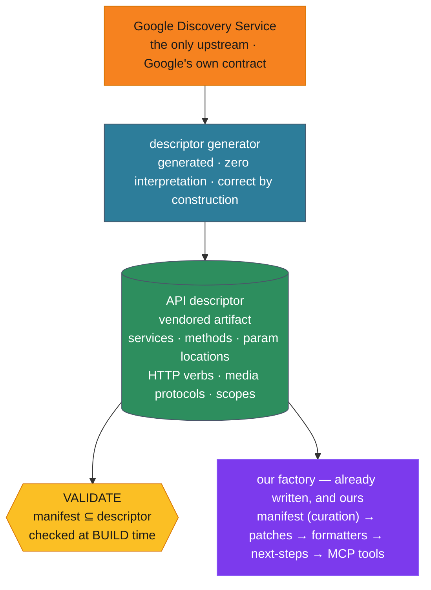

# ADR-103: Generate a Google API descriptor from Discovery; retire the gws facade

## Context

Every tool this server exposes ultimately becomes a subprocess call to `gws`, the Google Workspace CLI (`@googleworkspace/cli`). That dependency is now in a bad state — and, more importantly, investigating *why* it is a dependency at all revealed that it was never the right shape for us.

### gws is abandoned with the lights on

Measured 2026-07-11, not assumed:

| | |
|---|---|
| Last commit to `main` | **2026-03-31** (102 days) |
| Last npm publish | **2026-03-31** (`0.22.5`) |
| PRs merged since 2026-04-01 | **0** |
| PRs closed **unmerged** since 2026-04-01 | **120** |
| Open issues | 111 |
| Archived? | No. 29.6k stars, Apache-2.0 |
| Google's own framing | *"not an officially supported Google product"* |

The 120 closures are not a policy decision. They are a bot:

> `github-actions[bot]`: *"This PR has been inactive for 72 hours. Closing to keep the queue clean."*

Contributors are still submitting fixes, nobody is reviewing them, and a janitor bot closes them three days later. The code works; the project does not. No rescue is coming, and waiting does not improve our position — it degrades it, because `gws` drifts further from Google's live API every month it sits.

### But abandonment is not the real argument

The dependency-risk framing is a distraction. The real finding is what `gws` actually *does* for us, which turns out to be almost nothing.

**We already own identity.** `src/accounts/` mints and refreshes OAuth tokens directly against `oauth2.googleapis.com`. It never calls `gws`. The entire contract with the CLI is three lines in `src/executor/gws.ts`:

```ts
const accessToken = await getAccessToken(account);   // ours
env.GOOGLE_WORKSPACE_CLI_TOKEN = accessToken;        // we inject it
spawn(gws, [...args, '--format', 'json']);           // gws does HTTP, returns JSON
```

`gws` is a **stateless, token-injected HTTP client**. It holds no state we depend on.

**And our manifest already speaks Google, not gws.** Of 80 operations across 7 services:

- **70 (87%) are `resource:` style**, and those values are *literal Google Discovery method paths* — `users.messages.list`, `conferenceRecords.transcripts.list`, `documents.batchUpdate`. The responses our formatters parse are **raw Google API JSON** (`payload.headers`, `labelIds`, `{files:[…]}`). Google's contract in, Google's contract out.
- **10 (13%) are `helper:` style** — `+triage`, `+send`, `+reply`, `+agenda`, `+upload`. These are `gws` *inventions*: `+triage` returns a flat `{from, subject, date}` that the Gmail API never emits; `gws` synthesised it by hydrating `payload.headers`.

This is not a coincidence. `gws` is *itself* Discovery-driven — it reads Google's Discovery Service at runtime and builds its command surface dynamically. So its contract **is** Google's contract. **The factory (ADR-300, ADR-304) is portable by construction**, and that portability is the asset worth protecting.

### Proven, not asserted

An 87-line uninterpreted dispatcher — Discovery doc in, `fetch` out, raw JSON returned untouched — was run against live Google with our own token and diffed against `gws` for the same operations:

| Operation | Top-level keys | Item shape |
|---|---|---|
| `gmail users.messages.list` | identical | identical |
| `drive files.list` | identical | identical |
| `calendar calendarList.list` | identical | — |

**For the 70 resource operations, `gws` adds nothing.** It is a 19.2 MB Rust subprocess performing what `fetch` performs. Its remaining substance is the 10 helpers — and those are *interpretation for a CLI audience*, which we neither want nor should inherit. We already own an interpretation layer (patches, formatters, next-steps) aimed at the MCP contract. Consuming `gws`'s opinions and then re-forming them is formatting someone else's formatting.

### The reframing

`gws` is **someone else's miner, wrapped in the product baggage required to be an operational CLI** — argument parsing, human-readable output, terminal UX, cross-platform binary distribution, 40+ bundled "agent skills". We use the miner. We pay for the baggage: 19.2 MB of the bundle, a process fork on every tool call, PATH resolution, a Windows `.cmd` quoting workaround, stall detection, and a distribution problem that is a live blocker on Docker (#137).

**We do not need a CLI. We need a miner.**

## Decision

**Mine Google's API surface directly from the Discovery Service, build the factory on that, and retire `gws`.**

The supply chain becomes two stages with a hard, total boundary between them:



Three principles govern it.

**1. The core contract is generated and uninterpreted.** Discovery declares everything needed: `rootUrl`, `servicePath`, path templates, which parameters are path vs query vs body, `httpMethod`, `supportsMediaUpload` and its protocols, and scopes. The dispatcher is a mechanical function of that document. It fixes nothing, reshapes nothing, and holds no opinions — so there is nothing in it to get wrong. It is correct *by construction*, in the same sense a client generated from an OpenAPI document is.

This is a load-bearing constraint, not a matter of taste. The moment the core starts "helpfully" reshaping a response, it becomes a thing that can be subtly wrong in a way no test catches — which is precisely the defect class this codebase spent six review rounds learning to fear (ADR-101).

**2. All interpretation lives in our layer, in MCP contract space.** The patches, formatters, and next-steps we already own. The 10 helpers get reimplemented here — and better, because today we consume a shape chosen for a terminal.

**3. We mine the WHOLE surface, not only what we use.** The contract is generated for every method of every service we touch, including the hundreds of operations no tool exposes today. This costs nothing — it is a generated artifact — and buys three things:

- **Build-time manifest validation.** A typo (`users.mesages.list`), a parameter Google does not accept, a method Google deprecated: these become build failures. Today they are runtime surprises that `gws` discovers on a user's behalf.
- **Honest coverage.** `src/coverage/` currently diffs our manifest against *`gws`'s* surface. It would diff against *Google's*. Same tool, truthful source.
- **A visible frontier.** "Google exposes this and we do not surface it yet" becomes a query rather than an investigation. New tool capability becomes a manifest edit, not a research project.

### The assumption this ADR rests on

**Google's Discovery surface is complete, consistent, and publicly accessible — for the whole API, not merely the parts we currently use.** It is the mechanism Google publishes so that clients can be generated from it, and it is the mechanism `gws` itself relies on.

We are explicitly **not** assuming Google's APIs are *simple*, only that they are *described*. The description is the contract. If this assumption fails, the miner fails, and the fallback is to pin `gws 0.22.5` and vendor its binary.

**Verified: the surface is complete. All 70 resource operations in the manifest resolve against Discovery — zero unresolved.** (This is most of what item 10 asks; see the verification plan.)

### Where the documents live is itself something to ask, not derive

The obvious mental model — one Discovery endpoint, `…/discovery/v1/apis/{service}/{version}/rest` — **is wrong**, and so is the obvious correction. Measured, across the seven services we use:

| service | central `discovery/v1/apis/…` | self-hosted `{svc}.googleapis.com/$discovery` |
|---|---|---|
| gmail/v1, docs/v1, sheets/v4, tasks/v1 | 200 | 200 |
| drive/v3, calendar/v3 | 200 | **404** |
| meet/v2 | **404** | 200 |

Neither pattern is universal, so **a URL template is a guess**. The authoritative source is the Discovery **directory** (`https://www.googleapis.com/discovery/v1/apis`, 517 APIs), which publishes a `discoveryRestUrl` per API. Calendar is the proof that this is not pedantry: it lives at **`calendar-json.googleapis.com`** — a host no template would ever produce.

So the miner's entry point is the directory: *look the document up, do not construct its address.* This is the same discipline as the rest of the ADR — we do not know, we ask.

### The dispatcher is mechanical, but it is not trivial

Item 1's spike was uninterpreted and correct for the three ops it tried. Run against **all** of them (item 2), the same code failed six — and every failure was in *our* dispatcher, not in `gws`. Both are cases of the doc telling us something we did not listen to:

- **Global parameters are declared once, not per method.** `fields`, `alt`, `quotaUser`, `prettyPrint` live in `doc.parameters`, not `method.parameters`. Consulting only the method's, `fields` has no known `location`, falls through to the request body, and a `GET` silently drops it — which is precisely how `drive.listComments` died with *"The 'fields' parameter is required"*. **Merge `doc.parameters` with `method.parameters`.**
- **`{+var}` is RFC 6570 reserved expansion.** Meet's identifiers are paths (`conferenceRecords/abc`). Percent-encoding the `/` into `%2F` 404s every Meet sub-resource operation. The `+` sigil is the document *telling us* not to encode reserved characters. **Honour it; do not strip it.**

Neither adds interpretation — both are cases of reading *more* of the document, not of forming an opinion about the response. But they are the reason "it's just a fetch" is a dangerous summary.

## Consequences

### Positive

- **The 19.2 MB binary is deleted.** **Measured, not predicted:** the `.mcpb` bundle goes from the **10 MB** actually shipped in v3.0.0 to **4.3 MB** — a 57% cut, not the "roughly 1 MB" an earlier draft of this ADR claimed. That estimate assumed the bundle was mostly the binary. It is not: the floor is set by the MCP SDK (8.2 MB uncompressed) and zod (5.1 MB), against which our code and the 164 KB descriptor are noise. A real halving, not a 10x. The wrong number is recorded here rather than quietly corrected, because an ADR that revises its own claims downward is doing its job.
- **No subprocess.** `spawn`, PATH resolution, the Windows `.cmd` quoting workaround, stall detection, `ENOENT` diagnostics — an entire class of failure disappears, along with a process fork on every tool call.
- **Docker (#137) becomes tractable.** Much of that problem is shipping and locating a platform-specific binary. There would be no binary.
- **Better errors.** Google's actual error JSON, rather than scraping `gws`'s stderr.
- **Batching and concurrency become possible.** Google's batch endpoints are unreachable through a one-shot CLI.
- **We own the stack.** No dead upstream, no fork decision, no waiting on a bot to close our PR.

### Negative

- **We inherit the transport.** Google's quirks become ours: Gmail's raw RFC822 encoding, Drive's export MIME types, Meet's transcript pagination. `gws` carries 283 commits of accumulated handling; an unknown fraction is real and an unknown fraction is CLI baggage. **Determining that fraction is the entire point of the verification plan below.**
- ~~**Media upload is a real protocol, not a `fetch` call.**~~ **Resolved — see item 4 below.** Discovery does not merely declare `supportsMediaUpload`; it declares the upload *paths*, for both the simple and resumable protocols. Upload is therefore as mechanical as resource dispatch: read the path from the doc, PUT the chunks. A 35 MB Gmail attachment was uploaded and read back byte-for-byte identical against live Google. **This was the single largest unknown in this ADR, and it is no longer a risk.**
- **We must rebuild the MIME builder we deleted.** `src/services/gmail/mime.ts` records that our RFC822 builder "was removed when gws 0.18+ added native `--attach` support". Outbound `multipart/mixed` assembly is therefore a real thing `gws` does *for* us — one of the few. It is perhaps 30 lines (the spike carries a working version), but the ADR's framing of `gws` as doing "almost nothing" understated this, and honesty requires saying so.
- **The 10 helpers must be reimplemented.** Desired work, but work. Note that the media-bearing operations — `drive.upload` (`+upload`), `gmail.send`/`reply`/`replyAll` (`+send` et al.) — are *among* those helpers, so items 4 and 9 overlap more than the plan first assumed.
- **Discovery doc lifecycle is an open decision.** Fetch at runtime (network dependency at startup; breaks offline) or vendor snapshots (drift)? This ADR assumes **vendored, with a refresh script and a CI drift check** — but that is a decision, not a given.
- **Scope risk.** The failure mode of "it's just a thin dispatcher" is accidentally writing a Google client library. The discipline is absolute: **build exactly what the manifest's operations require, and nothing more.**

### Neutral

- The manifest, formatters, next-steps and the factory's structure are **unchanged**. The *shape* of the code survives; what changes is what sits under it.

- **The patches are NOT unchanged** — an earlier draft claimed they were, and that claim is retracted. `execute()` is a seam shaped like gws argv, and **30 of the 70 resource ops have `customHandlers`** (`generator.ts:218` — a custom handler short-circuits `buildArgs` entirely) that construct that argv **by hand, in TypeScript**. They must move to the typed client. See *The seam* above: the cost is ~96 mechanical call-site rewrites, 7 download sites, and exactly **one** error-handling site — bounded, and measured rather than guessed.
- `gws` remains Apache-2.0 and functional. Pinning `0.22.5` and vendoring the binary stays a legitimate fallback at any point.

## Naming: say what these are in ordinary engineering terms

The working shorthand for this ADR was "the mine" and "the factory". *Factory* is fine — it is the GoF pattern and the code already uses it. *Mine* is not a thing. What we are building has a boring, well-established name, and boring is correct for something a stranger has to maintain:

| This ADR's shorthand | The name we use | Why |
|---|---|---|
| Google Discovery document | **API specification** | Same role as OpenAPI or a `.proto`: an upstream, machine-readable description. |
| "the miner" | **descriptor generator** (build-time codegen) | Exactly what `protoc` / `openapi-generator` do — consume a spec, emit an artifact. |
| "the mined contract" | **API descriptor** | A pruned, generated, committed artifact derived from the spec. |
| the dispatcher | **API client** (transport) | The generated-SDK layer. |
| "mine coverage" | **API surface coverage** / **conformance** | Standard. |
| `src/factory/` | **factory** — unchanged | It genuinely constructs tool objects from a declaration. |

The pattern is **spec-driven (contract-first) code generation**:

```
API spec (Discovery) → generator (build) → descriptor (committed) → client (runtime) → factory → MCP tools
                                                ↑
                        conformance: manifest ⊆ descriptor · surface coverage · drift
```

### And what `gws` is, precisely

`gws` is a **service facade** over Google's API. That is not a slight — it is the accurate pattern name, and it explains the central measurement of this ADR:

**The two surfaces are identical. 233 operations, 233 in agreement, zero that Google declares and `gws` lacks.**

This is not a coincidence: `gws` is itself generated from the same Discovery documents. The *only* things in its surface that are not Google's are its **12 helper inventions** (`+send`, `+triage`, `+agenda`, `+upload`, `+read`, `+write`, `+append`, `+reply`, `+forward`, `+watch`, `+insert`). A facade that passes everything through and adds nothing at the resource level is a facade that can be removed — and the helpers, which are the only thing it *does* add, are interpretation aimed at a CLI audience, which we discard on purpose.

## The conformance tooling must be retargeted — it currently lints against `gws`, and against its *prose*

`src/coverage/` is how we answer "what does Google offer that we do not expose?" It does not use `execute()`; `discover.ts` shells out to the binary and **reconstructs the API surface by regex-scraping `--help` text**:

```ts
const resourceMatch = trimmed.match(/^(\w+)\s+Operations on the/);
const methodMatch   = trimmed.match(/^(\w+)\s+\S/);
```

This is API truth derived from **human-readable help formatting**. It has already produced a defect, and the defect is committed:

```json
"calendars.insert": { "status": "gap" },
"calendars.The":    { "status": "gap" },      // <- not an API method
"calendars.patch":  { "status": "gap" },
```

`calendars.The` is a **word from a wrapped description line**, captured as a method name and recorded in `coverage-baseline.json` as an uncovered gap — a nonexistent operation presented to future contributors as work they could pick up. Nothing caught it, because nothing could: the scraper's only source of truth is prose.

**The denominator is wrong in three ways.** Today's headline is *72/350 operations (21%)*. That 350 counts `gws`'s 12 helper inventions (not Google operations), at least one scraping phantom, and five services we deliberately do not support (`slides`, `people`, `chat`, `keep`, `events`). Measured against Google's real surface for the seven services we *do* support, coverage is **80/233 — 34%**.

**Retargeting is proven, not assumed.** The generated descriptor reproduces `gws`'s discovered surface exactly — 233/233, with zero operations Google declares that `gws` misses — so `discover.ts` collapses from a regex scraper into a lookup. This is a **verification item, not a footnote**: see item 11.

## The seam: replace `execute(argv)`, do not emulate it

An earlier draft of this ADR said the patches were unchanged because `execute()` is already the seam. That is half true, and the wrong half is load-bearing.

`execute()` **is** a seam — but it is a seam shaped like *gws argv*:

```ts
execute(['drive', 'files', 'get', '--params', JSON.stringify({ fileId, alt: 'media' }), '--output', outputPath], { account, cwd });
```

Keeping that shape while deleting gws means **parsing a CLI grammar for a CLI that no longer exists** — inventing an argv dialect, and a `--flag` vocabulary, purely to avoid touching callers. That is baggage adopted on purpose. We reject it.

**Decision: the seam becomes a typed client we own.**

```ts
call(service, resource, params, opts)      -> raw Google JSON
download(service, resource, params, path)  -> bytes to disk, never through a string
upload(service, resource, params, media)   -> resumable, chunked
```

### Why this is affordable — measured, not assumed

**80 `execute()` call sites** exist outside `gws.ts` (excluding tests). They are not 80 problems:

| Bucket | Count | What happens to it |
|---|---|---|
| **A. Resource call** (`--params` JSON, sometimes `--json` body) | **59** | Already resource-shaped. `execute([svc,a,b,'--params',JSON])` → `call(svc,'a.b',params)`. Mechanical. |
| **B. Resource + `--output`** (binary to disk) | **4** | → `download(...)`. **This one improves.** Today Gmail attachments come back as base64 *through stdout as a JSON string*: `gws.ts:158` accumulates the entire response into a JS string, uncapped, then `JSON.parse`s it. A 30 MB attachment becomes a ~40 MB string → object → Buffer. An owned client streams to disk. |
| **C. Helper call** (`+send`, `+agenda`, `+upload`, …) | **17** | Reimplemented as code (item 9). gws *inventions*; never Google's. |
| **D. Other** | **2** | `generator.ts:237` — see below — and `gwsVersion()`, which simply dies. |

**`generator.ts:237` is the chokepoint.** One `execute(args, {account, format:'json'})` fans out to *every manifest-driven operation across every service*, because `buildArgs()` produces either shape. Port that one site and the entire factory path moves at once. This is what the factory bought us, and it is why the count is bounded.

**The envelope is thinner than it looks.** No production code reads `.success` or `.stderr` — **every call site reads `result.data` and nothing else.** The envelope exists to describe a subprocess; without one, it collapses to "the raw JSON".

**The feared coupling is exactly one place.** `server.ts:101-110` branches on `err.exitCode === GwsExitCode.AuthError` and serializes `err.stderr` into the MCP error payload. That becomes a mapping over Google's real error JSON — which is *better*, and is item 7. Nothing else scrapes stderr.

### What the survey found that we did not expect

- **`src/coverage/discover.ts` dies with the subprocess.** It does not use `execute()` at all — it shells out to the binary and **scrapes `--help` and `schema` output with regexes**. It must be rewritten against the mined contract. That is not a loss: today it measures us against *gws's* surface, and the contract measures us against *Google's*. But it is work this ADR had not counted.
- **Two inconsistent body conventions already exist in our own code**, and must be normalised on the way through: `--json` with *no* `--params` (`calendar/patch.ts:193`, `send-doc.ts:41`), versus a `requestBody` nested *inside* `--params` (`scratchpad/handler.ts:419`, `send-sheet.ts:39`, `send-task.ts:50`). The client takes one body, so this ambiguity has to be resolved rather than carried across.
- **Some helpers return text, not JSON.** `+agenda` and `docs +export` return strings even under `--format json`, and three call sites defend with `typeof result.data === 'string' ? … : JSON.stringify(…)`. That is gws's CLI audience leaking into our types — precisely the "interpretation aimed at the wrong consumer" this ADR exists to discard.
- **The `cwd` directory-fence disappears.** Seven sites pass `cwd` for one reason only: to satisfy gws's path fence for `--attach` and `--output`. With an owned client, the fence — and `path.relative(getWorkspaceDir(), …)` in `gmail/patch.ts:171` — is unnecessary. (Our *own* workspace safety checks stay; it is gws's fence that goes.)

### Order of operations — do not lose the oracle

`gws` is the only reference we have for the 34 mutating ops nobody has diffed yet, and it is rotting. So:

1. Build the client **alongside** `execute()`. Nothing is deleted.
2. Verify the mutating ops against `gws` **while it still works** (item 2's remainder).
3. Migrate the 96 resource call sites behind the new seam.
4. Reimplement the 10 helpers (item 9), including the MIME builder.
5. **Then** delete `gws`, the binary, and `execute()`.

Deleting the subprocess first would destroy the instrument we need to verify the replacement. The oracle goes last.

## Verification plan — what must be proven before gws is removed

`gws` still works, which makes it a **test oracle** — and it is rotting. Use it while it is still trustworthy; every month of delay makes it a worse reference.

But the harness is **not a parity gate.** We *expect* divergence wherever `gws` interpreted, and each divergence is a finding rather than a bug. The question for each is: **is this Google's truth, or `gws`'s opinion?** Google's truth we must reproduce. `gws`'s opinion we deliberately discard.

| # | Question | How it is answered | Status |
|---|---|---|---|
| 1 | Is resource-style dispatch a pure pass-through? | 87-line dispatcher vs `gws`, live, diffed | **Done — YES** (3 services) |
| 2 | Does that hold for **all 70** resource ops? | Differential harness over the full manifest, live | **Partly — 26/70 diffed, 0 divergences.** All 26 read ops returned **byte-identical JSON** through `gws` and through uninterpreted dispatch. The 44 not yet diffed are named below. |
| 3 | What does `gws` do that Discovery does not declare? | Triage every divergence from (2): Google's truth vs gws's opinion | **Nothing, so far.** Zero stable divergences in 26 ops — there has been nothing to triage. This is the strongest evidence yet for the thesis. |
| 4 | **Media upload** — simple *and* resumable multipart? | Send a 35 MB attachment; upload to Drive. Both paths, working. | **Done — YES.** Simple, multipart and chunked-resumable all verified live. A 25 MB attachment (34.2 MB RFC822, 93% of Google's declared 36,700,160-byte cap) uploaded in 5 chunks and **read back byte-for-byte, SHA-256 identical**. |
| 5 | **Media download** — attachments, Drive export (`alt=media`) | Fetch an attachment; export a Doc to PDF | **Partly done.** Gmail `attachments.get` round-trips (it is how item 4 was verified). Drive export / `alt=media` still owed. |
| 6 | Pagination — who loops, and does anything rely on `gws` looping? | Inspect `nextPageToken` handling across the manifest | Not started |
| 7 | Error shapes — what do our handlers actually depend on? | Compare Google's error JSON against scraped `gws` stderr | Not started |
| 8 | Scopes — does Discovery's declared scope set match what we request? | Diff Discovery `scopes` against `src/accounts/oauth.ts` | **Done — YES, no gaps.** All 70 resource ops are satisfied by at least one of the 10 scopes we request; zero would 403. The contract carries `scopes` per method, so this check is now mechanical. **Note the subtlety:** Discovery lists scopes as *alternatives* (any one suffices), not as a required set — reading the 37 distinct scopes it names as "scopes we need" would be a misreading. |
| 9 | The 10 helpers — what does each actually do? | Read `gws`'s Rust source; reimplement as patches | Not started |
| 10 | Does the mined contract cover every manifest op? | Build-time validation: manifest ⊆ contract | **Containment proven; the build gate is not built.** All 70 resource ops resolve against Discovery, zero unresolved. Wiring that into the build as a failing check is still to do. |

| 11 | **The conformance tooling** — `src/coverage/` scrapes `gws --help` with regexes and dies with the subprocess. Can the descriptor replace it? | Diff the descriptor-derived surface against the `gws`-scraped one | **Done — YES.** 233/233 agree; **zero** operations Google declares that `gws` misses. The one difference (`calendars.The`) is *our* scraper hallucinating a method from a wrapped description line — and it is committed in `coverage-baseline.json` as a `"gap"`. `discover.ts` collapses into a descriptor lookup. **Rewriting it is in scope, not a footnote.** |

**The gate for retiring `gws` is that all eleven are answered — and that (4) is answered by a working 35 MB attachment send, not by reading a specification.**

### What item 2 has NOT covered — stated, so that "0 divergences" cannot be misread

`0 divergences` is a true statement about **26 of 70** operations. It is not a statement about the other 44, and the harness prints them by name rather than letting a clean summary imply coverage it does not have.

- **34 mutating ops** (`POST`/`PATCH`/`PUT`/`DELETE`). Not executed. Diffing these live means creating and deleting real data in a real account; they need reversible create→read→delete round-trips in a sandbox, not a naive replay.
- **5 media ops** (`drive.download`, `drive.viewImage`, `drive.export`, `gmail.viewAttachment`, plus `drive.getComment`, which needs a comment to exist). These belong to item 5.
- **5 Meet ops** (`getTranscript`, `listTranscriptEntries`, `getRecording`, `getSmartNote`, `getFullTranscript`) — the test account has no transcripts or recordings, so there is nothing to fetch.

One further caveat worth its own line: three Meet list ops (`listTranscripts`, `listRecordings`, `listSmartNotes`) are recorded as *identical*, but **both sides returned an empty object**. That is a vacuous match. It proves the call succeeded and that both agree there is nothing; it does not compare a populated shape. It should not be counted as strong evidence.

## Alternatives Considered

**Pin `gws 0.22.5`, vendor the binary, change nothing.** Entirely legitimate today: it works, it is Apache-2.0, and the pin costs nothing immediately. Rejected as a *destination* but retained as the **fallback** if the media tail proves long. Its cost is not static — every month `gws` drifts further from Google's live API with nobody to fix it, and the oracle we would use to escape it becomes less trustworthy. Doing this while `gws` still works is strictly cheaper than doing it after it breaks.

**Fork `gws`.** We would maintain a cross-platform Rust CLI, its release pipeline and its argument surface, in order to use it as a library. All of the baggage, none of the users. Rejected.

**Switch to another Workspace CLI.** Trades one unowned dependency for another in the same risk class, and we would rewrite the argument-construction layer regardless. It also keeps the subprocess, the binary, and the distribution problem. Rejected.

**Adopt `googleapis` (the official Node client).** A real option: Google-maintained, generated from the same Discovery documents. Rejected as the *core* because it is a large static artifact that inverts our model — our manifest is dynamic and Discovery-shaped by design, and `googleapis` would have us map our contract onto its generated surface instead of onto Google's. It remains a sensible fallback for a specific hard sub-problem; **resumable media upload is the obvious candidate**, and using it there would not compromise principle (1).

**Wait for Google's official Workspace MCP server.** Announced, but reportedly single-user by design. Our multi-account model — an `email` parameter on every call rather than a session-bound identity — is the product. Not a substitute. *(Unverified: reported, not measured. If it becomes load-bearing to this decision, verify it first.)*
