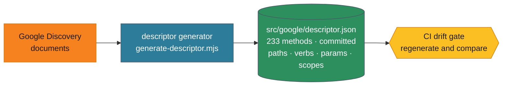
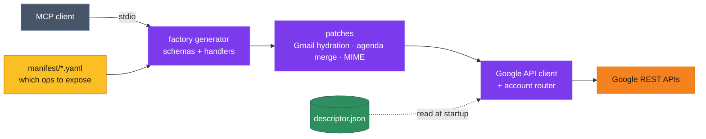

# How it works

You don't need any of this to use the server — see the [README](../README.md) to install it.
This is for people who want to know what's underneath, or who want to add an operation.

## The two phases

Two phases. Google's API specification is acquired at **build time** and frozen into a committed artifact; at **runtime** the server only reads it.

### Build time — acquire the specification



### Runtime — dispatch against it



**The descriptor** is generated from Google's Discovery documents and committed. A CI drift gate re-generates it and fails if the result differs, so the spec we dispatch against cannot silently fall behind Google.

**The client** (`src/google/client.ts`) is deliberately opinion-free: it builds the request Google's spec describes and returns exactly what Google returned. It does not reshape responses. All interpretation lives in patches and formatters, aimed at the MCP contract — which is what keeps "what Google said" and "what we chose to show" separable.

**The factory** reads the YAML manifest and generates MCP tool schemas and handlers at startup. **Patches** add behavior where an agent needs more than a raw API response — hydrating Gmail search results with senders and subjects, merging an agenda across calendars, building MIME for outbound mail. Operations without a patch get sensible defaults.

Because method names are generated into a TypeScript union, calling a method Google doesn't publish is a **compile error**, not a 404 at runtime.

## Adding an operation

The coverage mapper diffs what the manifest exposes against what Google actually publishes, so the frontier is always measured rather than estimated:

```bash
npm run generate-descriptor   # re-read Google's Discovery documents
make coverage                 # what we expose vs. what Google offers
make manifest-lint            # validate the curated manifest
make check                    # type-check, lint, test, build, smoke
```

To expose a new operation, add it to the relevant `src/factory/manifest/*.yaml`. The descriptor already knows its path, verb, parameters, and scopes, and the factory generates the tool schema and handler. New operations get default formatting automatically — add a patch only when an agent needs a shaped response rather than a raw one.

## Design

The server generates its API client from Google's own Discovery documents and calls Google directly. Nothing sits between the server and the API it targets: there is no subprocess, no second response shape, and no unversioned wrapper to keep in step. The descriptor is regenerated and diffed against Google on every build, so a method that does not exist is a compile error rather than a runtime surprise.

On top of that sits the manifest-driven tool factory: adding an operation is a YAML edit, not a code change. The coverage mapper reads Google's real published surface, so "what we expose vs what exists" is a measured number.

The reasoning behind this design, including what was verified and what it cost, is in **[ADR-103](docs/architecture/core/ADR-103-generate-a-google-api-descriptor-retire-the-gws-facade.md)**.
